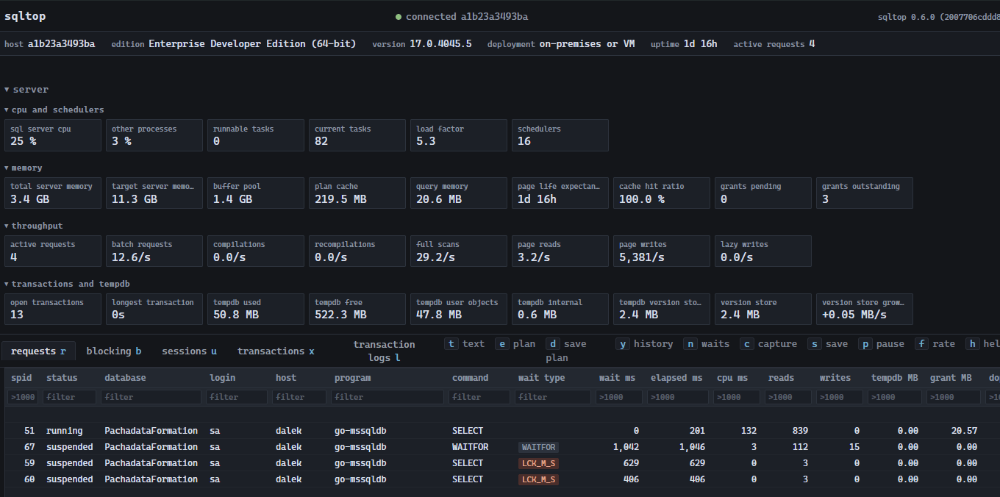
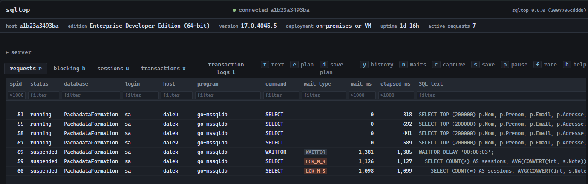
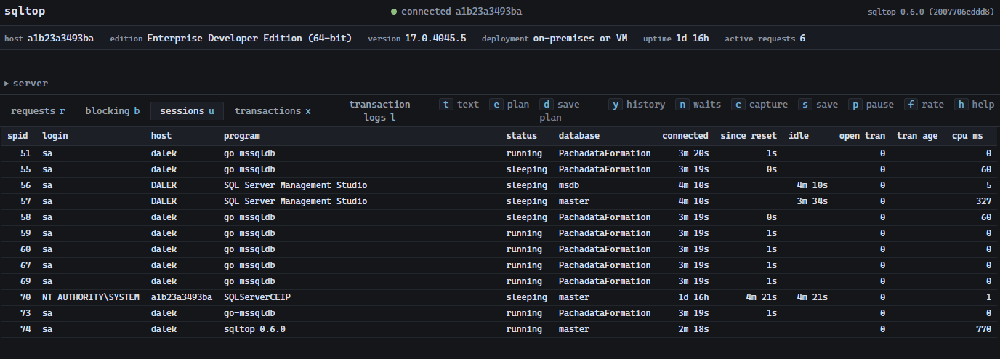
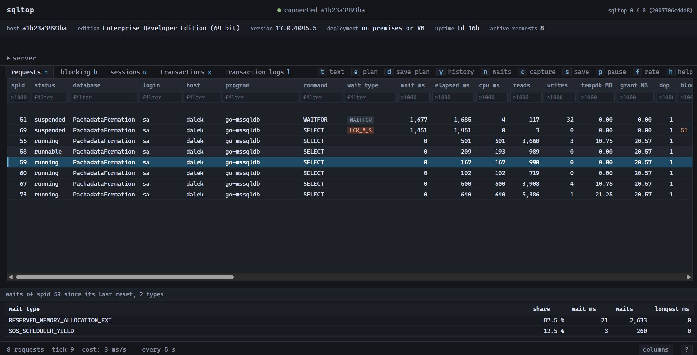
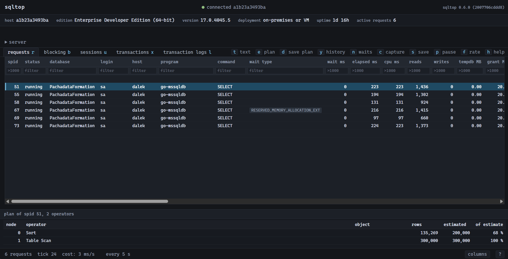

# Screenshots

## Server metrics

The server dashboard and live requests in one view, covering CPU, memory,
throughput, transactions and tempdb.

## Active requests

The compact request grid shows running and suspended work, current waits and
the SQL text, with a filter for every column.

## Sessions

The sessions view includes connection age, idle time, open transactions and
resource use.

## Session waits

Selecting a request and opening its waits shows the distribution accumulated
by that session since the last reset.

## Live execution plan

The plan view follows an executing statement and compares actual rows with the
optimizer's estimates.

## Session history

The rolling history keeps recently completed statements on the selected session, 
including their peak duration, CPU and wait type.

